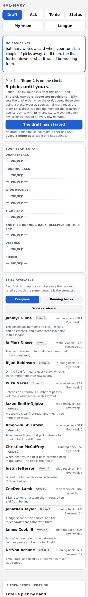
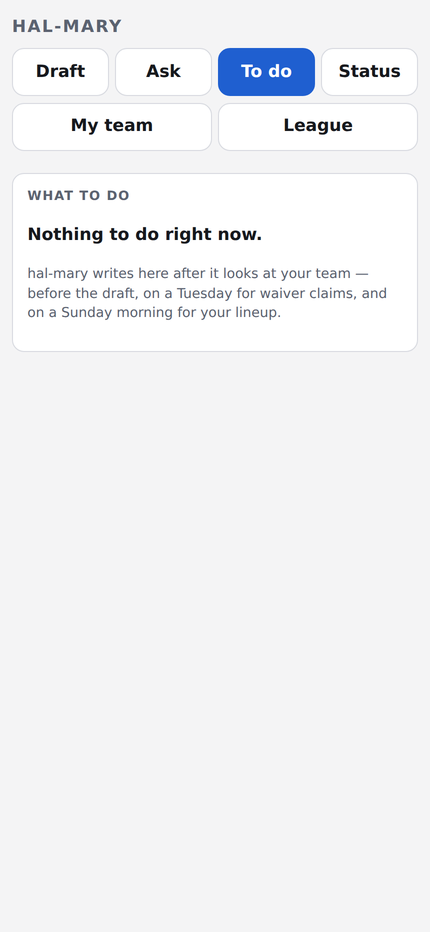
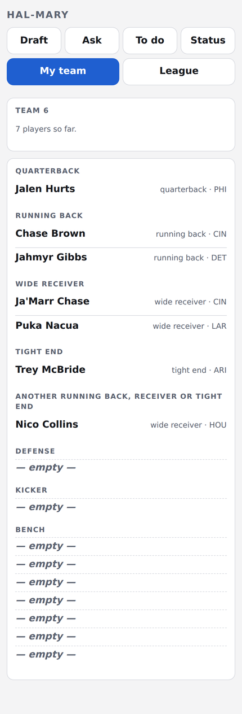
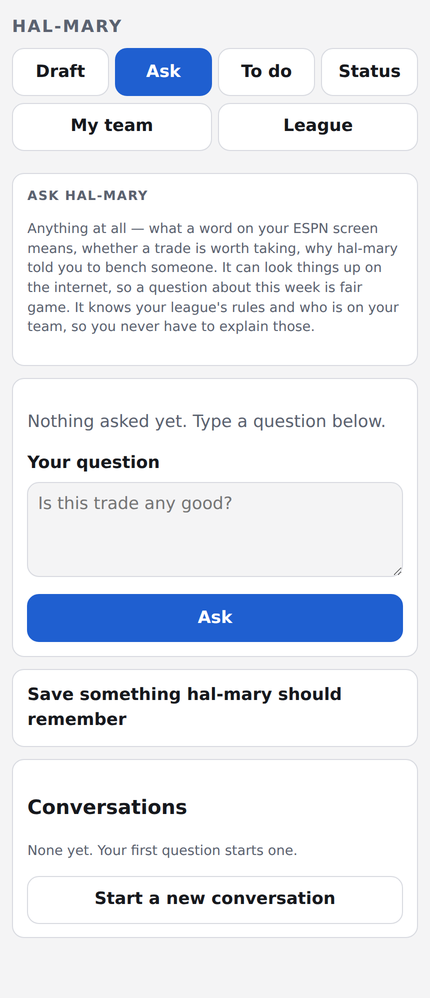
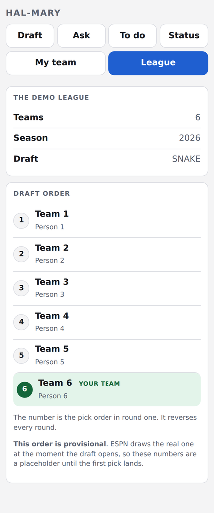
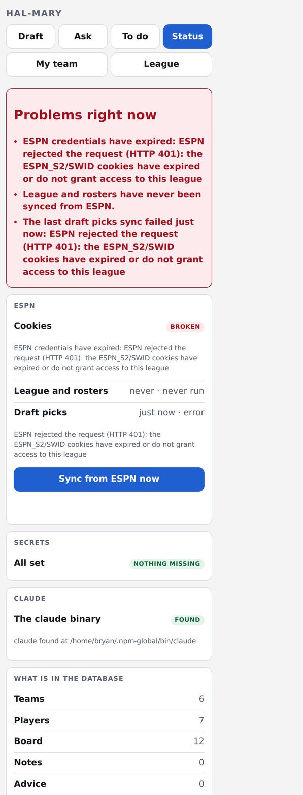
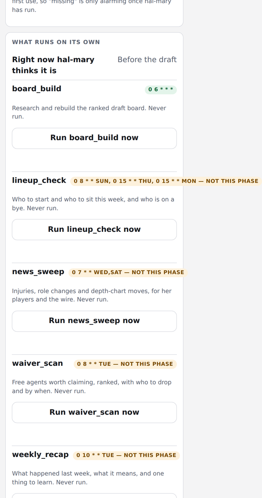

# hal-mary

**A Claude-powered fantasy football manager for people who do not follow football.**

[](#testing)
[](pyproject.toml)

Caroline joined an ESPN fantasy league knowing the rules of football and nothing else — no players,
no strategy, no idea how a draft works. hal-mary closes that gap. It watches her league, researches
the live internet through the local `claude` binary, and tells her what to do in plain English,
assuming zero football knowledge.

It runs full time on a small VM: a phone-friendly web app, a draft-night advisor on a 90-second pick
clock, a scheduler for the in-season jobs, and an MCP endpoint that lets Claude act on her team
without ever letting Claude *decide* on her team.

<p align="center">
  
</p>

<p align="center"><em>Draft night. The card names one player and says why, in words that assume nothing.</em></p>

---

## The interesting parts

**It never guesses about football.** The model's training has a cutoff and the season does not, so
every football fact comes from a Claude call with web tools on and is stored with the URL it came
from. Every research prompt is handed today's date and two windows — what counts as news, and the
point past which a source cannot decide a ranking on its own — because a model with no anchor
treats its own cutoff as the present and says so confidently.

**It works when ESPN does not.** Whether ESPN publishes picks live is genuinely unverified — two
full mock drafts showed zero picks on the read API for as long as they were watched. So picks have a
hand-entry path that needs no ESPN at all, and if the draft is running while ESPN stays quiet the
page stops saying "watching every 5 seconds" and tells her to type them in.

**The advisor cannot make a slow call.** A `claude -p` call with web search takes 30–120 seconds and
this league's pick clock is 90. So research happens *before* the draft and on-the-clock advice runs
with web tools **off**, against a board already built. A test asserts the advice job's tool list is
empty, for exactly that reason.

**Claude executes but never chooses.** In season hal-mary emits an *action*; Claude Cowork's browser
performs it in ESPN's own interface. Cowork's browser reads pages five other league members write
into, so an executor with no discretion gives injected text nothing to redirect. Notes from that
browser are quarantined in the prompt, under their own heading, with their own budget.

**Two doors, two keys.** The dashboard is LAN-only behind a session password. `/mcp` carries a
separate bearer token and is path-scoped at the edge, so a valid MCP token still 404s on `/draft`.
With the token unset the endpoint answers 503 — absent never means open.

---

## See it without credentials

The app is dull when empty and the real one needs ESPN cookies, a league id and a Claude
subscription. So there is a demo:

```bash
uv sync
uv run python scripts/demo_seed.py /tmp/demo/hal.db   # writes the db and an env file beside it
HAL_MARY_ENV=/tmp/demo/env uv run hal-mary serve      # then open the URL it prints; password: demo
```

Six teams called `Team 1`..`Team 6`, owned by `Person 1`..`Person 6`, and a small board of real NFL
players. **Every screenshot in this README is taken against that demo**, because the live league
contains four real people and a public README cannot.

---

## What it looks like

### Draft night

| | |
|---|---|
|  | **One card, one player, one reason.** Written when her turn is a couple of picks away, against a board built the night before. It names the fallback if someone takes him first, and what to worry about. |

### The rest of the app

| | |
|---|---|
|  | **My team.** Slots are named, never coded: the flex reads *"another running back, receiver or tight end"*, because "FLEX" is not a word she has any reason to know. |
|  | **Ask.** The one place with web tools on the request path. It already knows her league, her roster and where the draft got to, so she can ask "why him?" and get a real answer. |
|  | **League.** The draft order, and an honest note that ESPN draws the real one when the draft opens — so the numbers are a placeholder until the first pick lands. |

### Diagnostics



**Problems first, in words.** ESPN cookies expire every few weeks and the failure is silent, so the
status page leads with what is broken and what it means — not a green tick that is only true because
nothing has been checked.



**What runs on its own, and when.** Each job with its real cadence, the phase it belongs to, and a
button to run it now.

---

## How it works

```
                    ESPN (read-only)          the live internet
                          |                          |
                          v                          v
                   espn/client.py            claude_runner.py  ── the only module
                          |                          |            that spawns `claude`
                          +------------+-------------+
                                       v
                           SQLite  (board · notes · actions
                                    picks · chat · advice)
                                       |
              +------------------------+------------------------+
              v                        v                        v
     FastAPI + HTMX + SSE      APScheduler jobs          MCP endpoint /mcp
     phone-first dashboard     board · news · waivers    8 tools, bearer token
              |                lineups · recap                  |
              v                                                 v
          Caroline                                      Claude Cowork
        (every draft click)                        (executes, never chooses)
```

**Football reasoning lives in Markdown**, not in Python. `prompts/*.md` is the strategy and can be
edited without touching code; Python does the bookkeeping — which players are gone, which slots are
open, how many picks until her turn. An unfilled placeholder raises rather than reaching the model,
because a prompt that silently says "there are {{team_count}} teams" produces advice for a league
that does not exist.

**Everything tunable is in `config.toml`**, keyed per job: models, timeouts, cadences, budgets,
poll intervals. No model name is hardcoded anywhere.

---

## Testing

```bash
uv run pytest            # 1493 tests
uv run ruff check .
```

Tests never reach the network — `tests/conftest.py` blocks all three HTTP stacks in play — and never
spawn the real `claude` binary except one live integration test that skips when the binary or its
auth is missing.

The suite leans hard on **sabotage**: a guard is not trusted until breaking the thing it guards has
been shown to turn it red. Several tests exist because a previous version passed against broken
code — the fixture encoded the author's belief, so it could not contradict the belief that caused
the bug. `docs/DECISIONS.md` records those, and why.

---

# Runbook

**Written for the person reading it in six months having forgotten everything.** It assumes nothing.

hal-mary runs on its own VM as a **systemd user service**. Everything below is done over SSH as
`bryan`, on that box.

## Where everything is

| What | Where |
|---|---|
| The box | `you@halmary.example.com` — `192.0.2.10` |
| The checkout | `~/hal-mary` |
| The database | `~/hal-mary-data/hal.db` (plus `-wal` and `-shm` beside it) — the default when `DB_PATH` is empty |
| Backups | `~/hal-mary-data/backups/hal-<timestamp>.db`, nightly |
| Secrets | `~/hal-mary/.env` — mode 0600, gitignored, never in git |
| The unit files | `~/.config/systemd/user/hal-mary*.{service,timer}` |
| Their source | `~/hal-mary/deploy/` — edited there, copied across by `install.sh` |
| Logs | the systemd journal; there is no log file |
| The web app | `https://dashboard.example.com` (Traefik, LAN-only) or `http://192.0.2.10:8080` direct |
| The MCP endpoint | `https://mcp.example.com/mcp` — a different door with a different key; see §7 |

### Always use the FQDN or the IP. Never `ssh you@halmary`.

The short name `hal-mary` has **no DNS record**. It falls through Pi-hole's wildcard
(`address=/example.com/192.0.2.20`) and lands on `192.0.2.254` — the keepalived ingress VIP,
which answers as **`birdo`, the swarm manager**. It connects. It gives you a shell. It is the wrong
machine, and running install steps there would put a long-running service onto the cluster's control
plane, on a Raspberry Pi booting from an SD card.

This has already happened once during this project. Use `halmary.example.com` or `192.0.2.10`.
The short name will start working only when someone adds a real DNS record for it.

(The polarity is the opposite of the warning in `swarm-config/docs/dev-scratch-swarm-access.md`,
where the short name is right and the FQDN wrong. Do not generalise either rule. Resolve the name
and look at the answer.)

---

## 1. First install, from nothing

Seven steps, in order. Steps 1.3 and 1.5 are the two no script can do for you.

### 1.1 Create the VM

A Proxmox VM, Ubuntu 24.04, x86_64. The one already built has 8 cores, 6 GB RAM and 28 GB of disk,
which is comfortable. Give it a static lease at `192.0.2.10` and an SSH key — it accepts
**publickey only**, password authentication is off, so `ssh-copy-id` cannot bootstrap it. The key
has to go on from the Proxmox console.

**Do not join it to the Docker Swarm.** It is a standalone application host. The cluster already has
three managers across three failure domains; a fourth would raise the Raft quorum from 2 to 3 while
still surviving only one loss, which is strictly worse.

### 1.2 Provision it

From dev-scratch:

```bash
ssh you@halmary.example.com 'bash -s' < deploy/provision-vm.sh
```

Idempotent, safe to re-run. Installs node 22, Claude Code, `uv`, `sqlite3`, `git` and `jq`; enables
**linger**, so a user service survives logout and starts at boot; and creates `~/hal-mary-data` on
the VM's own disk.

Deliberately no Docker and no Claude Code plugins — hal-mary invokes `claude` with
`--setting-sources "" --strict-mcp-config`, so every call ignores installed plugins and MCP servers
by design.

**Working:** `ssh you@halmary.example.com 'ls ~/hal-mary-data && ~/.local/bin/uv --version'`
answers without error.

### 1.3 Log `claude` in — the one step no script can do

```bash
ssh you@halmary.example.com
claude          # follow the login flow, once
```

`claude` authenticates from a **subscription session in `~/.claude.json`**, not from an API key.
There is nothing to put in `.env`. The service inherits that session because it runs as this user,
which is the whole reason hal-mary is a systemd *user* unit rather than a system one, and the reason
it is not in a container.

Until this is done, hal-mary serves every page and produces **no advice at all**. `install.sh`
refuses to proceed without it.

**Working:** `claude -p hello` answers. "Not logged in · Please run /login" means it is not done.

### 1.4 Get the code onto the box

```bash
git clone git@github.com:gitgat/hal-mary.git ~/hal-mary
```

If the box has no GitHub deploy key: add one, use an HTTPS URL, or `rsync -a` the checkout across
from dev-scratch. Any of the three is fine — the scripts only need `~/hal-mary` to be a git checkout
with a remote it can fast-forward from.

### 1.5 Fill in `.env`

Every key, what it is and where it comes from, is in [§9.1](#91-the-env-file). The fast path:

```bash
cd ~/hal-mary
python3 scripts/espn-auth.py     # asks for the cookies, verifies them, finds the team id
```

That script writes `~/hal-mary/.env` at mode 0600 and **merges** — it leaves keys it did not ask
about alone. It prompts for `ESPN_S2`, `SWID`, `LEAGUE_ID`, `TEAM_ID`, `SEASON` and (if it is not
already set) `WEB_PASSWORD`, and it writes nothing if ESPN rejects the cookies, so a bad paste costs
nothing. Or copy `.env.example` and fill it in by hand.

**`MCP_TOKEN` is not one of the keys it asks for.** Add it by hand if Claude Cowork or Claude Desktop
is going to connect — [§7](#7-connecting-claude-to-hal-mary-over-mcp). Leave it out and `/mcp`
answers 503 to everything, which is the correct closed state.

**`DB_PATH` may be left empty.** It then defaults to `~/hal-mary-data/hal.db`, which is where it
belongs. Writing it out explicitly is still clearer:

```
DB_PATH=/home/you/hal-mary-data/hal.db
```

What must not happen is a *relative* value. Every configured path is resolved against the directory
holding `config.toml` — the checkout — so `DB_PATH=./hal.db` puts the database, and the `backups/`
directory that follows it, inside the one directory `git pull` rewrites, a rollback moves, and a
re-clone loses. `hal-mary doctor` has a **database location** check for exactly this, and it is
fatal once `~/hal-mary-data` exists.

The other rule is the filesystem: `~/hal-mary-data` is on the VM's **own disk**. `/var/data` on
every machine in this homelab is a TrueNAS NFS export, and **SQLite on NFS corrupts**. Doctor checks
that too and refuses an install onto a network mount.

**Working:** `uv run hal-mary doctor` reports `environment  every required key is set in .env`.

### 1.6 Install

```bash
~/hal-mary/deploy/install.sh
```

It checks everything before it installs anything — `uv`, the checkout, a populated `.env`, a
writable data directory, and then `hal-mary doctor`, which is where "claude is not logged in" is
caught. If any of that fails, the box is left exactly as it was. Then it applies migrations, copies
the three unit files into `~/.config/systemd/user/`, enables linger, starts `hal-mary.service` and
`hal-mary-backup.timer`, and waits for `/healthz` to answer before claiming success.

If `doctor` refuses and you are certain it is wrong — the `claude` login check reads an undocumented
key in Claude Code's own config file, so it *can* be wrong if that format changes — then
`HAL_MARY_SKIP_DOCTOR=1 ~/hal-mary/deploy/install.sh`. The checks still run and still print; only
the refusal is turned off, and the output says so in capitals. The same variable works on
`deploy.sh`.

The units say `%h/hal-mary`. If the checkout is somewhere else, `install.sh` substitutes the real
path in as it installs; when it is the default the installed file is byte-identical to
`deploy/hal-mary.service`, so `diff` against the checkout is a meaningful check.

### 1.7 Verify

```bash
systemctl --user status hal-mary                      # active (running)
curl -fsS http://127.0.0.1:8080/healthz               # {"status":"ok"}
systemctl --user list-timers hal-mary-backup.timer    # a NEXT time, not a blank
```

Then open `https://dashboard.example.com` on a phone on the LAN — or
`http://192.0.2.10:8080` if Traefik is not up — log in with `WEB_PASSWORD`, and press
**Sync** on the status page. The problems box at the top of `/status` should be empty afterwards.

Last, seed the board so there is something to advise from:

```bash
ssh you@halmary.example.com 'cd ~/hal-mary && uv run hal-mary job board_build'
```

---

## 2. Is it broken, and which kind of broken?

There are several completely different failures with different answers, and getting this backwards
costs an hour. Find the symptom first.

| Symptom | The question | Where to look |
|---|---|---|
| The page will not load at all | Is the **service** running? | `systemctl --user status hal-mary` — then [restarting](#restarting) |
| `HAL_MARY_ENV points at ... which is not a file` in the journal | Has `.env` been moved or deleted? | [below](#hal_mary_env-names-a-file-that-is-not-there) |
| Pages load; ESPN data is stale, sync fails, a red box mentions 401 | Have the **ESPN cookies** expired? | `/status`, then [§3](#3-rotating-the-espn-cookies) |
| Pages load; advice is generic, thin, or never arrives | Is **`claude`** working? | `/status` has a Claude row — then `journalctl` |
| `claude: command not found` in the journal | Is the unit's **PATH** right? | [below](#claude-command-not-found-in-the-journal) |
| Advice reads as if it has forgotten who Caroline is | Are the **paths** right? | the "Where the files are" card on `/status` |
| Nothing recurring has run for days | Did the **scheduler** start, and what phase does it think it is? | the "What runs on its own" card on `/status`; `uv run hal-mary jobs` |
| The draft page shows frozen picks | Did the **draft loop** start? | a band across the top of `/draft` says why, if not |
| The draft page says the pick numbers are provisional, all night | Has the drawn order ever been read? | expected with hand-entered picks — see [draft night](#draft-night) |
| A Claude connector says 503, 401 or 404 on `/mcp` | Is `MCP_TOKEN` set, and is the route right? | [§7](#7-connecting-claude-to-hal-mary-over-mcp) |
| The nightly backup has not run | Is the **timer** enabled? | `systemctl --user list-timers hal-mary-backup.timer` — [§5](#5-backups-and-restoring-from-one) |

**`systemctl` answers "is the process up". `/status` answers everything else.** That page is built
for exactly this: every problem it can detect goes in a red box at the top — missing `.env` keys, an
ESPN 401, a missing `claude`, a missing memory directory, a sync that failed — and it lists every
resolved path with whether it exists, what has run recently, and what Cowork did.

That is also why the service **boots even when something is wrong**. A unit that refused to start
because the memory directory had gone missing would be down at 2am with nobody watching, and the one
page that would have told you why is the page that no longer loads. So it starts, it serves, and it
says on `/status` what is wrong. The refusing is done by `hal-mary doctor` at install and deploy
time, when a human is actually looking.

### Reading logs

```bash
journalctl --user -u hal-mary -f                      # follow, live
journalctl --user -u hal-mary -n 200 --no-pager       # the last 200 lines
journalctl --user -u hal-mary --since "1 hour ago"
journalctl --user -u hal-mary -p err                  # errors only
journalctl --user -u hal-mary-backup --since yesterday
```

There is no log file. One place to look, rotated by systemd.

`--user` matters. Without it you are asking about a *system* unit that does not exist, and you get
an empty result rather than an error — which reads exactly like "the service has never logged
anything".

### Restarting

```bash
systemctl --user restart hal-mary
systemctl --user stop hal-mary
systemctl --user start hal-mary
```

If it refuses to start and `status` says something like `start request repeated too quickly`:

```bash
systemctl --user reset-failed hal-mary
systemctl --user start hal-mary
```

### `HAL_MARY_ENV` names a file that is not there

The unit names `~/hal-mary/.env` explicitly, and the config loader refuses to start when a path it
was *told* to use is not there — a typo'd path that silently loaded no secrets is the failure that
check exists to prevent. So this is one of the few things that does stop the service outright, and
it means the `.env` file has been moved or deleted. Restore it (`python3 scripts/espn-auth.py`
rebuilds it) and restart.

### `claude: command not found` in the journal

This is the most likely way hal-mary ends up running and useless. A systemd user unit does **not**
inherit your interactive shell's `PATH`, and both `uv` and `claude` are installed per-user
(`~/.local/bin`, `~/.npm-global/bin`). The unit sets `Environment=PATH=` explicitly for that reason.

Check what the running service actually has:

```bash
systemctl --user show hal-mary -p Environment
```

If `.npm-global/bin` is missing from it, the installed unit is out of date with
`~/hal-mary/deploy/hal-mary.service`. Re-run `install.sh` (or fix it by hand and
`systemctl --user daemon-reload && systemctl --user restart hal-mary`).

### `cannot serve: WEB_PASSWORD not set`

`serve` refuses to start without it, and this is the only thing it refuses over. The app binds every
interface on the house network and the database it serves holds live ESPN session cookies, so
"start anyway with no password" is not an option it offers. Set `WEB_PASSWORD` in `.env` and restart.

---

## 3. Rotating the ESPN cookies

**This is the maintenance event of the season.** ESPN's cookies are session credentials with no
refresh flow. They expire after a few weeks, or whenever that ESPN account signs out everywhere.
When they go, syncing stops and everything downstream quietly gets worse.

**Symptom:** `/status` shows a red box mentioning 401 or authentication, the ESPN row is not OK, and
the sync ages stop moving.

### The steps

1. **Confirm it is the cookies and not the service.**

   ```bash
   ssh you@halmary.example.com
   cd ~/hal-mary
   uv run hal-mary espn-check
   ```

   Nonzero with a message about 401 or authentication means the cookies. A connection error means
   something else, and `journalctl` is the next stop.

2. **Get fresh values from a browser.** On a desktop, signed in to `fantasy.espn.com` **as the
   account that is actually in the league** — Caroline's. A cookie from an account that cannot see
   the league returns 401 no matter how well-formed it is.

   - Open the league page.
   - `F12` → **Application** (Chrome) or **Storage** (Firefox) → **Cookies** →
     `https://fantasy.espn.com`.
   - Copy **`espn_s2`**. It is a few hundred characters and contains `%` escapes. Copy it exactly,
     including those.
   - Copy **`SWID`**. It looks like `{XXXXXXXX-XXXX-XXXX-XXXX-XXXXXXXXXXXX}`. **Keep the braces.**
     Stripping them is the single most common cause of a 401 here.

3. **Put them on the box.** The helper is the safe way: it verifies against ESPN *before* writing,
   merges into the existing `.env` rather than replacing it, hides the input, and re-writes at mode
   0600.

   ```bash
   cd ~/hal-mary
   python3 scripts/espn-auth.py
   ```

   It writes nothing if ESPN rejects the values, so a bad paste costs nothing.

   By hand instead: edit `~/hal-mary/.env`, replace `ESPN_S2=` and `SWID=`, change nothing else.
   Never `git add` it — it is gitignored, and these are live session credentials.

4. **Check they took.**

   ```bash
   uv run hal-mary espn-check      # must exit 0
   ```

5. **Restart the service so it picks up the new `.env`.** The file is read once at startup; editing
   it changes nothing until then. **This step is the one people forget**, and its symptom is
   "I fixed the cookies and the status page still says 401".

   ```bash
   systemctl --user restart hal-mary
   ```

6. **Confirm from the app.** Open `/status`, press **Sync**, and watch the sync ages go to "just
   now" and the red box disappear.

**Never paste these values into a commit, an issue, a chat log, or a test fixture.** Holding them is
equivalent to being logged in as that ESPN account.

**During a live draft, do not stop to do this.** The draft page takes picks by hand, and the advisor
runs against a board that was built before the draft, so a dead cookie costs the automatic pick
feed and nothing else. Cookies are a between-drafts job.

---

## 4. Deploying a change

```bash
ssh you@halmary.example.com
~/hal-mary/deploy/deploy.sh
```

It fast-forwards, syncs dependencies, runs `hal-mary doctor`, applies migrations, runs the **full
test suite**, restarts the service, and then polls `/healthz` until it answers. It aborts, having
changed nothing that matters, if:

- the working tree is dirty or has untracked files — it names them;
- the branch has diverged from the remote — it will only `--ff-only`, never merge or rebase, because
  a merge commit created by a script on a production box is a commit nobody will ever review;
- `doctor` finds something fatal;
- **the test suite is red** — nothing is restarted and the service keeps running the old code;
- the service does not answer `/healthz` after the restart.

It prints the previous commit at the top and again at the end. That is the SHA to roll back to.

Three things worth knowing:

- **`memory/league.md` is generated and gitignored.** A checkout that still tracks it receives a
  deletion on pull, and git refuses when the local copy differs. That refusal is correct — the file
  holds real leaguemates' names — but it looks like a broken deploy. Fix with
  `git rm --cached memory/league.md`, then re-run; `hal-mary sync` rewrites the file.
- To deploy to a box `doctor` says is not ready — for instance, to ship the fix that makes it ready
  — `HAL_MARY_SKIP_DOCTOR=1 ~/hal-mary/deploy/deploy.sh`. The checks still run and print; only the
  refusal is turned off.
- `deploy.sh` **re-executes itself once, immediately after the pull**, and prints `re-reading` when
  it does. That is not a bug: a script rewritten underneath a running bash can resume at a stale
  byte offset and skip everything after it while still exiting 0. Today's git replaces a changed
  file with a new inode rather than truncating the old one, so it does not actually bite — the
  re-exec is what makes that an implementation detail of git rather than a load-bearing assumption.

### Rolling back

```bash
cd ~/hal-mary
git log --oneline -10               # or use the SHA deploy.sh printed
git checkout <sha>
uv sync
systemctl --user restart hal-mary
curl -fsS http://127.0.0.1:8080/healthz
```

Deliberately by hand rather than a `rollback.sh`. A rollback happens when something is already
wrong, and a script that ran migrations backwards would be the second thing wrong.

**Migrations are forward-only.** Rolling the code back does not roll the schema back, so a rollback
across a migration only works because the schema changes have all been additive. They have been so
far; check the new migration before assuming it for the next one.

The checkout is on a detached HEAD afterwards. `git checkout main` once the real fix is in.

---

## 5. Backups, and restoring from one

A timer runs `hal-mary backup` nightly at 04:17 UTC, with up to ten minutes of jitter, keeping the
newest **14** snapshots — `backup.keep` in `config.toml`.

```bash
systemctl --user list-timers hal-mary-backup.timer
ls -lh ~/hal-mary-data/backups/
journalctl --user -u hal-mary-backup --since "2 days ago"
systemctl --user start hal-mary-backup.service        # take one right now
```

`Persistent=true` on the timer means a night the box was switched off is caught up when it comes
back rather than silently skipped.

**Why this is not `cp`.** The database runs in WAL mode and the service writes to it while the
backup runs. In WAL mode a committed row can live entirely in `hal.db-wal` with nothing of it in
`hal.db`, so a copy of the main file alone opens cleanly, passes an integrity check, and has
silently lost the newest notes — which are the ones the season is made of. `hal-mary backup` uses
SQLite's online backup API and produces one self-contained file with no sidecars.

**What is actually at risk.** Everything else regenerates: ESPN state resyncs in seconds, the draft
board rebuilds from a job. The **notes** — the season's accumulated research, written by every job
and read into every prompt — exist nowhere else.

### Restoring

```bash
systemctl --user stop hal-mary                                 # 1. stop the writers
cd ~/hal-mary-data
mv hal.db hal.db.broken && rm -f hal.db-wal hal.db-shm         # 2. the bad one aside, and its
                                                               #    sidecars with it
cp backups/hal-<timestamp>.db hal.db                           # 3. the snapshot you want
sqlite3 hal.db "PRAGMA integrity_check; SELECT count(*) FROM notes;"
systemctl --user start hal-mary                                # 4.
```

Step 2 matters: leaving a stale `hal.db-wal` beside a restored `hal.db` is how a restore produces a
database that is neither the backup nor the original.

### Copying a backup off the box

Nothing does this automatically today. The snapshots live on the same VM as the database they
insure, which covers "the database got corrupted" and not "the VM died". If that matters, add a
periodic `rsync` **pulled from another machine** — and note that `/var/data` is fine as a *destination*
for copies. It is only running the live database from there that corrupts.

---

## 6. What runs on its own, and when

`hal-mary serve` is the whole service. One process, three things inside it:

- the **web app** — the draft page, chat, to-do list, team, league and status;
- the **job scheduler** (APScheduler, on the app's own event loop);
- the **draft loop**, on its own thread with its own database connection.

Ask the running build rather than trusting this table:

```bash
uv run hal-mary jobs        # every job, its cadence, its phase, and how it went last time
```

### The scheduler, and the phase

Which jobs are scheduled at all depends on which **phase** hal-mary thinks it is in. The phase is
re-evaluated daily (`scheduler.phase_cron`, 04:20), so a process started the week before the draft
becomes an in-season process by itself rather than at the next restart someone remembers.

| Phase | When | Jobs registered |
|---|---|---|
| `pre_draft` | before the draft, less `scheduler.draft_window_before_hours` | `board_build` |
| `draft_live` | the window around the draft | none scheduled — the draft loop is what is working |
| `in_season` | after the draft, for `scheduler.season_days` | `news_sweep`, `waiver_scan`, `lineup_check`, `weekly_recap` |
| `off_season` | after that | none |

With no draft date known, the phase falls back to the only other evidence there is: a real draft
pick means the draft has happened.

| Job | Cadence (`scheduler.timezone`, `America/Los_Angeles`) | Why then |
|---|---|---|
| `board_build` | `0 6 * * *` | every morning before the draft, so the board is never a day old |
| `news_sweep` | `0 7 * * wed,sat` | first in the week, then once the weekend's news has landed |
| `waiver_scan` | `0 8 * * tue` | before ESPN processes claims on Wednesday |
| `lineup_check` | `0 8 * * sun`, `0 15 * * thu`, `0 15 * * mon` | ESPN locks each player at *his own* kickoff, so one Sunday check would lose a Thursday starter |
| `weekly_recap` | `0 10 * * tue` | after the week has finished |

A late fire still runs: `scheduler.misfire_grace_time_s` is an hour, because APScheduler's default of
one second drops a fire missed while the loop was busy, in silence. A job never overlaps with itself
(`max_instances=1`), and a failing job is recorded and never reaches the scheduler — hal-mary with a
broken waiver scan is worth a great deal; hal-mary not running is worth nothing.

`hal-mary job <name>` runs any one of them now, and the status page has the same button. A job with
`enabled = false` is kept off the schedule but still runs when asked for by name — that is the whole
point of the flag.

Three `[jobs.*]` entries are **not** scheduled jobs and will not appear in `hal-mary jobs`:
`draft_advice`, `draft_advice_retry` and `chat`. They are the model configuration for calls made on
the request path.

### The draft loop

Its own thread, its own connection, three cadences chosen from ESPN's own draft board — how many
slots the board has, and how many hold a real player:

| Board says | Cadence |
|---|---|
| no picks yet | `draft.idle_poll_seconds`, 5 minutes |
| some picks, not all | `draft.poll_seconds`, 5 seconds |
| every slot filled | stopped |

Five seconds around the clock would be 2,073,600 requests a season against an unofficial API on one
household's cookies, for a job that needs about 2,160 of them once.

ESPN's `drafted` and `inProgress` flags decide nothing: `drafted` is set late, and `inProgress`
describes the lobby rather than picks. **The draft has started** (`POST /draft/started`) is an
override that holds the fast cadence for `draft.live_override_seconds`; it is never the mechanism.

A loop that will not start — no ESPN credentials, for instance — is logged as a warning and the app
serves anyway, with a band across the draft page saying why. Picks can be entered by hand and a page
that renders beats a page that does not.

### The nightly backup

A separate systemd timer, not the scheduler: `hal-mary-backup.timer` at 04:17 UTC. See
[§5](#5-backups-and-restoring-from-one).

### What is *not* running here

**Claude Cowork's scheduled tasks run at claude.ai, not on this box.** They are saved prompts on a
cadence in Cowork's own scheduler, and they reach hal-mary through `/mcp`. `uv run hal-mary
cowork-config` prints the schedule rendered for this league — including the waiver time, which is
derived from the league's own processing day rather than assumed. [`docs/COWORK.md`](docs/COWORK.md)
is the setup.

**The Cloudflare tunnel is a human job.** `cloudflared` on the swarm plus a DNS route; nothing in
this repo does it or should. The tunnel maps the MCP path *only* — see
[§7](#7-connecting-claude-to-hal-mary-over-mcp). **The dashboard stays LAN-only.** It is protected by
a single shared password and it renders live ESPN session state; it does not go on the public
internet.

---

## 7. Connecting Claude to hal-mary over MCP

hal-mary exposes an MCP endpoint at `/mcp` so Claude can read the roster, the board and the advice,
and can report back what it did. **It is a different door from the dashboard**, with a different key:
`MCP_TOKEN`, never `WEB_PASSWORD`. One shared credential would put a live ESPN session on the public
side of that boundary. With `MCP_TOKEN` unset the endpoint answers **503** — absent never means open.

### The two URLs, and which to use

| From | URL | Path |
|---|---|---|
| Anywhere, including outside the house | `https://mcp.example.com/mcp` | Cloudflare tunnel → `traefik-public` |
| On the LAN | the same URL | UniFi wildcard → the internal Traefik |

Both are routed with `PathPrefix(/mcp)` and nothing else, so `/draft`, `/chat` and the dashboard
**404 on that hostname even with a valid token**. That scoping is the whole boundary: hal-mary serves
the dashboard from the same port, so a router matching the bare host would publish it to the internet.

Read the token (it is never printed into a doc, a commit, or a log):

```bash
ssh you@halmary.example.com "grep '^MCP_TOKEN=' ~/hal-mary/.env | cut -d= -f2-"
```

### Claude Code

Claude Code speaks HTTP natively, so it needs no bridge:

```bash
claude mcp add --transport http hal-mary https://mcp.example.com/mcp \
  --header "Authorization: Bearer <MCP_TOKEN>"
```

### Claude Desktop

**Claude Desktop cannot use the command above, and its "Add custom connector" UI cannot do this
either.** Two separate reasons, both worth knowing before you spend an evening on it:

1. Desktop's `mcpServers` entries are **stdio-only** — the schema is `{command, args, env,
   extensionId}`. There is no `url` and no `headers` key. An HTTP entry is valid JSON, fails
   validation, and shows up only as *"Some MCP servers couldn't be loaded"* at launch.
2. The **Add custom connector** dialog takes a URL and then expects OAuth. It has no field for a
   static `Authorization` header, which is what hal-mary uses.

So Desktop reaches a remote server through the `mcp-remote` bridge. Edit
`~/Library/Application Support/Claude/claude_desktop_config.json` on macOS, or
`%APPDATA%\Claude\claude_desktop_config.json` on Windows:

```json
{
  "mcpServers": {
    "hal-mary": {
      "command": "/opt/homebrew/bin/npx",
      "args": [
        "-y", "mcp-remote", "https://mcp.example.com/mcp",
        "--header", "Authorization:${HAL_MARY_AUTH}"
      ],
      "env": {
        "HAL_MARY_AUTH": "Bearer <MCP_TOKEN>",
        "PATH": "/opt/homebrew/bin:/usr/bin:/bin:/usr/sbin:/sbin"
      }
    }
  }
}
```

Three details that are each a wasted hour if you get them wrong:

- **`Authorization:${HAL_MARY_AUTH}` has no space after the colon, and the token lives in `env`.**
  Desktop mangles arguments that contain spaces, so the natural
  `"Authorization: Bearer abc..."` arrives corrupted. `mcp-remote` does the substitution itself.
- **Use an absolute path to `npx`.** Desktop launched from Finder does not get a login shell, so an
  `nvm`-managed node is invisible to it and the server fails with `ENOENT`. `which npx` in a normal
  terminal gives you the path to paste.
- **Quit Desktop completely and reopen it.** Config is read at launch; closing the window is not
  enough.

Then check it: the connector list should show `hal-mary` with eight tools — `get_roster`,
`get_board`, `get_advice`, `get_league`, `pending_actions`, `report_action`, `report_observation`
and `cowork_schedule`.

### When it does not connect

```bash
# Does the endpoint answer at all? 401 here is CORRECT — it means it is reachable and gated.
curl -s -o /dev/null -w '%{http_code}\n' https://mcp.example.com/mcp

# Does the token work? A 200 and a JSON result means the server is fine and the problem is client-side.
curl -s -X POST https://mcp.example.com/mcp \
  -H "Authorization: Bearer <MCP_TOKEN>" \
  -H 'Content-Type: application/json' \
  -H 'Accept: application/json, text/event-stream' \
  -d '{"jsonrpc":"2.0","id":1,"method":"initialize","params":{"protocolVersion":"2025-06-18","capabilities":{},"clientInfo":{"name":"probe","version":"1"}}}'

# Desktop's own logs name the failure:
tail -n 50 ~/Library/Logs/Claude/mcp*.log        # macOS
```

| Symptom | Cause |
|---|---|
| `503` | `MCP_TOKEN` is not set in `.env` on the VM. Set it and restart the service. |
| `401` with a token you believe in | The header was mangled — check there is no space after `Authorization:` |
| `404` on `/mcp` | You reached something other than hal-mary. From the LAN this means the internal Traefik route is missing. |
| `404` on `/draft` | **Correct.** Only `/mcp` is routed on that hostname. |
| "Some MCP servers couldn't be loaded" | An HTTP-style entry in Desktop's config. It only takes the stdio form above. |
| `ENOENT` / server never starts | Bare `npx` with an `nvm` node. Use the absolute path. |

### Rotating the MCP token

The token ends up in plaintext in the Desktop config, so rotate it if that file is ever shared or
if it has been pasted anywhere:

```bash
ssh you@halmary.example.com "cd ~/hal-mary && \
  sed -i \"s|^MCP_TOKEN=.*|MCP_TOKEN=\$(head -c 32 /dev/urandom | base64 | tr -d '/+=' | head -c 40)|\" .env && \
  systemctl --user restart hal-mary"
```

Then update the client config with the new value. Every existing connection breaks until you do —
that is the point of rotating it.

---

## 8. Command reference

Run from `~/hal-mary` on the box, or from a checkout on a laptop.

```bash
uv run hal-mary doctor          # can this box run hal-mary? nonzero on a fatal problem
uv run hal-mary espn-check      # are the ESPN cookies still good? nonzero when they are not
uv run hal-mary sync            # pull league state and draft picks from ESPN
uv run hal-mary jobs            # every job, its cadence, its phase, and how it went last time
uv run hal-mary job <name>      # run one job now, by name
uv run hal-mary cowork-config   # Cowork's scheduled tasks, rendered for this league; --json
uv run hal-mary migrate         # apply pending schema migrations
uv run hal-mary backup          # snapshot the database now, and prune to backup.keep
uv run hal-mary serve           # what the service runs; --reload for development
```

The job names, as of this build: `board_build`, `news_sweep`, `waiver_scan`, `lineup_check`,
`weekly_recap`. `hal-mary job <typo>` answers with the list rather than a traceback, so the CLI is
always the authority.

**Exit codes**, because `espn-check` and `doctor` are read by scripts:

| Code | Means |
|---|---|
| `0` | fine. For `doctor`, warnings only — a warning never blocks a deploy. |
| `1` | it did not work: ESPN refused, the job failed, `doctor` found something fatal, the backup could not be written. |
| `2` | not configured: a required `.env` key is missing, or an unknown job name. |

**Safe to run at any time, including during a draft:** `doctor`, `jobs`, `cowork-config`, `--help`.
None of them touch the network or spawn `claude`.

**Not safe during a draft:** `job board_build` (minutes of paid Claude calls) and anything that
restarts the service.

Two environment variables move the configuration itself, and are set by the systemd unit:

| Variable | Effect |
|---|---|
| `HAL_MARY_CONFIG` | path to `config.toml`. **Every other path is anchored to its directory.** |
| `HAL_MARY_ENV` | path to the `.env` file. Naming a file that does not exist stops the process. |
| `HAL_MARY_SKIP_DOCTOR=1` | `install.sh` / `deploy.sh` print doctor's findings but do not refuse over them. |

---

## 9. Configuration reference

Two files, with a hard split between them:

- **`.env`** holds secrets and the identity of the league. Gitignored, mode 0600, never in git.
- **`config.toml`** holds every tunable — models, cadences, tool allowlists, timeouts and budgets.
  Tracked in git. Nothing in `src/` hardcodes a model name, a timeout or a cadence.

**Every path in either file is resolved against the directory holding the `config.toml` that was
actually loaded** — never the working directory, which is the checkout for a developer and something
else entirely under systemd. Absolute values are used exactly as given. Resolved against the working
directory instead, a service started anywhere but the checkout would find no `memory/`, and every
prompt would go out without the standing context that says who Caroline is — no crash, no error,
just worse advice. `Settings.resolved_paths()` is what the "Where the files are" card on `/status`
renders.

### 9.1 The .env file

Copy [`.env.example`](.env.example), which carries key names and nothing else.

| Key | Required | What it is, and where it comes from |
|---|---|---|
| `ESPN_S2` | yes | The `espn_s2` browser cookie from a desktop signed in to `fantasy.espn.com` **as an account that is in the league**. A few hundred characters with `%` escapes in it; copy it exactly. Expires every few weeks — [§3](#3-rotating-the-espn-cookies). |
| `SWID` | yes | The `SWID` cookie, `{XXXXXXXX-…}`. **Keep the braces.** Stripping them is the single most common cause of a 401. |
| `LEAGUE_ID` | yes | The number in any league URL: `…/league?leagueId=<your-league-id>`. Treat it as an identifier for a private league, not as public information. |
| `TEAM_ID` | yes | Caroline's team id within the league, from her team page URL (`teamId=`). `scripts/espn-auth.py` finds it for you. |
| `SEASON` | yes | The season year, e.g. `2026`. |
| `WEB_PASSWORD` | yes | The one shared password for the web app. Any long random string. `serve` **refuses to start** without it: the app binds every interface on the house network and the database holds live ESPN session cookies. |
| `MCP_TOKEN` | no | Bearer token for `/mcp`. Deliberately **not** the same string as `WEB_PASSWORD` — two doors, two keys, because `/mcp` is reachable from the internet through the tunnel and the dashboard is not. `openssl rand -hex 32`. Unset means `/mcp` answers 503 to everything; absent never means open. |
| `DB_PATH` | no | Where the SQLite file lives. Empty defaults to `~/hal-mary-data/hal.db`, which is correct: local disk, outside the checkout. A **relative** value is anchored to `config.toml`'s directory and so lands inside the checkout — the one directory a deploy replaces and a rollback moves — and the `backups/` directory follows it there. Must not be on NFS; SQLite on NFS corrupts. `doctor` checks both. |

`hal-mary doctor` reports every missing required key by name. `scripts/espn-auth.py` fills in all of
them except `MCP_TOKEN`, verifying the cookies against ESPN before it writes anything, and merging
rather than replacing so it never clobbers a key it did not ask about.

Not every command needs every key. `sync` needs `ESPN_S2`, `SWID`, `LEAGUE_ID` and `SEASON`. `serve`
needs `WEB_PASSWORD` and nothing else — it starts, degraded and honest, on a box with no ESPN
credentials at all, because picks can be entered by hand.

### 9.2 config.toml, section by section

Read [`config.toml`](config.toml) itself for the reasoning; every value carries a comment saying what
it costs to get wrong. This is the map.

| Section | What it decides |
|---|---|
| `[claude]` | Which binary, the default model (`opus`), the permission mode, the scratch directory the `claude` subprocess runs in, and the system prompt file. |
| `[paths]` | `prompts_dir` and `memory_dir`. Football reasoning lives in Markdown under `prompts/`, not in Python. |
| `[draft]` | The three loop cadences, how close to her turn a card is written (`advise_within_picks`), how long "the draft has started" holds, how big the board is, how much of it each prompt sees, and the wall-clock budget one tick may spend. Also the commented-out `[league]` block — the manual fallback for the league's own settings when there is no ESPN at all. |
| `[research]` | How much live state the four in-season jobs put in front of Claude, and the two recency windows. Recency is the *main* filter on research, not a tie-breaker: the season is live and the model's training cutoff is not. |
| `[scheduler]` | The phase windows, the season length, the daily phase check, the timezone every cron below is read in, and the misfire grace. |
| `[espn]` | Connect and read timeouts for the raw ESPN reads. Bounded by the pick clock: a read that outlives its poll interval silently stops the draft loop. |
| `[backup]` | How many snapshots to keep (`keep = 14`), and where. `dir` is deliberately unset, which means "a `backups/` directory beside the database". |
| `[web]` | Host, port, cookie names, session lifetime, the SSE heartbeat, login rate limiting, how stale the draft page may get before it warns, and `shutdown_timeout_s` — which is what makes `SIGTERM` work at all while a phone has `/events` open. `forwarded_allow_ips` must name the proxy when behind Traefik, or the session cookie is silently issued without `Secure`. |
| `[chat]` | How much memory a chat question gets. Larger than the draft's, and with no age cutoff, because a chat question has no pick clock and "how has my season gone" is about months ago. |
| `[jobs.<name>]` | Per job: `model`, `tools`, `timeout_s`, `max_budget_usd`, `enabled`, and `cron` (a string or a list). **`jobs.draft_advice.tools` must stay empty** — that call runs on a 90-second pick clock and a web search takes 30 to 120 seconds. A test asserts it. |
| `[cowork]` | The timezone Cowork's own scheduling form is filled in with (the operator's, not the server's), and how far ahead of waiver processing a claim run happens. It must match `[scheduler].timezone`; a test refuses a config where it does not. |
| `[actions]` | When an NFL week rolls over, in UTC. Every emitted action expires at that boundary, and emission equivalence is scoped by it — the same bench twice on a Sunday is one click, the same bench next Saturday is a new decision. |

**The tunables most likely to be worth changing**, and what happens if you do:

| Value | Default | Raising it |
|---|---|---|
| `draft.advise_within_picks` | `2` | A card appears earlier, against a board with more unknowns still in it. |
| `draft.advice_budget_s` | `60` | More time for the on-the-clock call, against a 90-second pick clock. Bounds only what the advisor *starts*, not an ESPN read already in flight. |
| `draft.max_source_share` | `0.25` | Lets one website decide more of the board. At `0.25` no outlet may decide more than 50 of 200 — the first real build cited one ranking article for 103 of them, which is a board every other manager can already read for free. |
| `research.note_shelf_life_days` | `14` | Older notes stay in prompts. In a live season that is usually wrong. |
| `backup.keep` | `14` | More nights of snapshots, more disk. A count of files rather than days, because the timer can miss a night. |
| `web.session_max_age_days` | `30` | Set so she is never logged out mid-draft. |

## Status

Under active construction against a draft deadline. This repository is entirely AI-authored: Bryan
owns judgment and outcomes, the agent owns mechanism. See [`CLAUDE.md`](CLAUDE.md) for the rules that
autonomy is paid for with.
